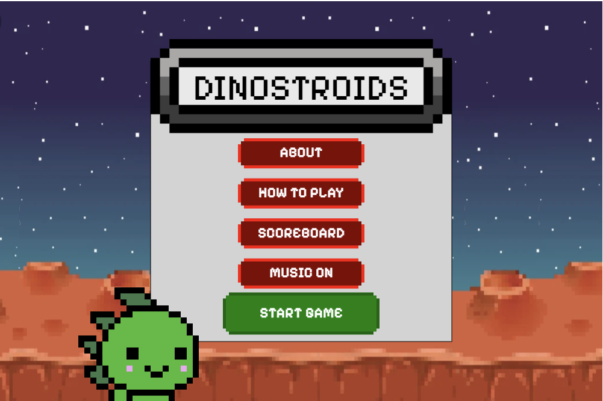

# DINOSTROIDS ☄️🦖



## Developers & Designers: 
[Catharina Düring](https://github.com/cadring)\
[Ragnar Gulin](https://github.com/ragnargulin)\
[Kevin Hellgren](https://github.com/Kind606)\
[Kasper Vikström](https://github.com/kaspvik)\ 
[Omar Al-mehdhar](https://github.com/Omar-Alme)\

## Game Description
**Defend Mars from an asteroid invasion!**  
*Long before humans mastered space travel, dinosaurs fled Earth to rule Mars. Now, asteroids threaten their new home. Arm your lasers, grab power-ups, and fight back!*  

---

## 🌟 Features  
- **3 Asteroid Types**  
  🪨 **Regular** (10pts, 1 damage) | 💥 **Big** (15pts + splits into smaller asteroids, 2 damage) | ☄️ **Super** (20pts, 4 damage)  
- **Power-Ups**  
  🛡️ **Shield** (7s protection) | 🔥 **Super Laser** (destroy everything in its path!) | ❤️ **Extra Life** (max 5 lives)  
- **Progressive Difficulty**  
  Asteroids fall faster as your score increases!  
- **High Score System**  
  Compete for the top spot and save Mars!  

---

## 🎮 Controls  
- **← → Arrow Keys**: Move left/right  
- **Spacebar**: Shoot lasers  

---

## 🚀 Installation & Play  
1. **Install Dependencies**  
   ```bash  
   npm install  

## Game Description

Välkommen till den förinställda kodbasen för slutprojektet.
Se filen [Sketch](./src/sketch.ts) och [Game](./src/game.ts) filerna för hur ni bör börja skriva er kod!

Kom ihåg att använda git!

Projektet använder sig av [Typescript](https://www.typescriptlang.org/) och [p5.js](https://p5js.org/). Det är varmt rekommenderat att ni läser på om dessa två teknologier innan ni börjar skriva kod.

OBS: Undvik [DOM funktionerna i p5.js](https://p5js.org/reference/#group-DOM) eftersom de **inte** är canvasspecifika och kommer inte fungera som ni förväntar er.


### Installation

Först behöver ni köra kommandot `npm install` för att installera nödvändiga moduler (p5, typescript, etc).

### Starta projektet

Kör kommandot `npm run dev` för att starta projektet och se det live i din webbläsare!

### Debugger

Det är starkt rekommenderat att ni använder debug-verktyget i VSCode för att hitta och lösa problem. Metoden vi primärt har använt tidigare är att skriva `console.log` men vi kan bli mer effektiva!

Debuggern låter er stanna programmet och stega rad för rad samtidigt som ni kan titta på vad variablerna innehåller. Det är speciellt användbart när ni arbetar med funktioner som anropas 60 gånger per sekund - console overload otherwise... 🤯

#### Starta Debuggern

För att starta debuggern tycker du på `F5` eller via play-knappen i "ActionBaren", se dock till att du har startat projektet innan (`npm run dev`). Ett nytt fönster kommer att öppnas som behöver användas för att få koden att stanna vid utsatta debugg-punkter.

### Potentiella problem

Versionen av p5.js är 1.5.0 medan senaste version av p5 typerna endast är uppdaterad till 1.4.3. Detta skulle kunna orsaka problem och det kan vara så att ni hittar något i p5's dokumentation som inte finns tillgängligt i detta projektet - dock osannolikt.

Typings för de globala variablerna relaterat till p5.sound fungerar tyvärr inte - exempel finns för hur ni kan kringgå detta. Se [loadSound funktionen](global.d.ts) för hur det kan göras.

Eftersom det här projektet är konfigurerat till att fungera utan `import/export` så det ibland vara så att typescript kompilatorn inte hittar en klass. För att lösa det kan du lägga till en referens kommentar som berättar för typescript vart klassen är deklarerad.

Lägg till följande `/// <reference path="to-file-with-class" />` längst upp i filen som genererade felet och skriv korrekt sökväg.
